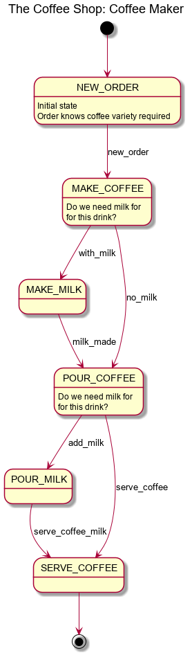

# the-matrix/the-coffee-machine

## What
Provides a an example case of using [the-matrix/finite-state-machine](https://github.com/the-matrix/finite-state-machine)

We use a simple coffee shop as a the use case:

- customer walks in and orders a variety of coffee
- the coffee making person makes it and serves it 

Heres our workflow:

 

## Why

State Machines are useful, but they become really useful when they are
event driven.  This example demonstrates that.

You could call it a 'workflow'

## How

This example is not in Packagist. Simply clone the repo, run
`composer install` and then navigate to the `bin` directory and run
the `coffee-shop.php' file. Read the code in it and try the variations
suggested.

The event Dispatcher is a PSR-14 implementation [Crell/Tukio](https://github.com/Crell/Tukio).
I chose it as it is framework agnostic. You can use any other PSR-14
compliant EventDispatcher, and even those that aren't, but you may have to
do a bit of wiring to get them to work. Symfony & Zend come to mind.

## Where

https://github.com/the-matrix/finite-state-machine

## To think about

How could you extend this to provide a bill for the coffee?  Can you 
interface to a separate billing system?

PHP is inherently single threaded, how can you staff up 5 coffee makers
in the shop?

## License

This software library is released under the [BSD 3 Clause license](https://opensource.org/licenses/BSD-3-Clause)

This software library is Copyright (c) 2018-2019, Ashley Kitson, UK

see [License](LICENSE.md)
